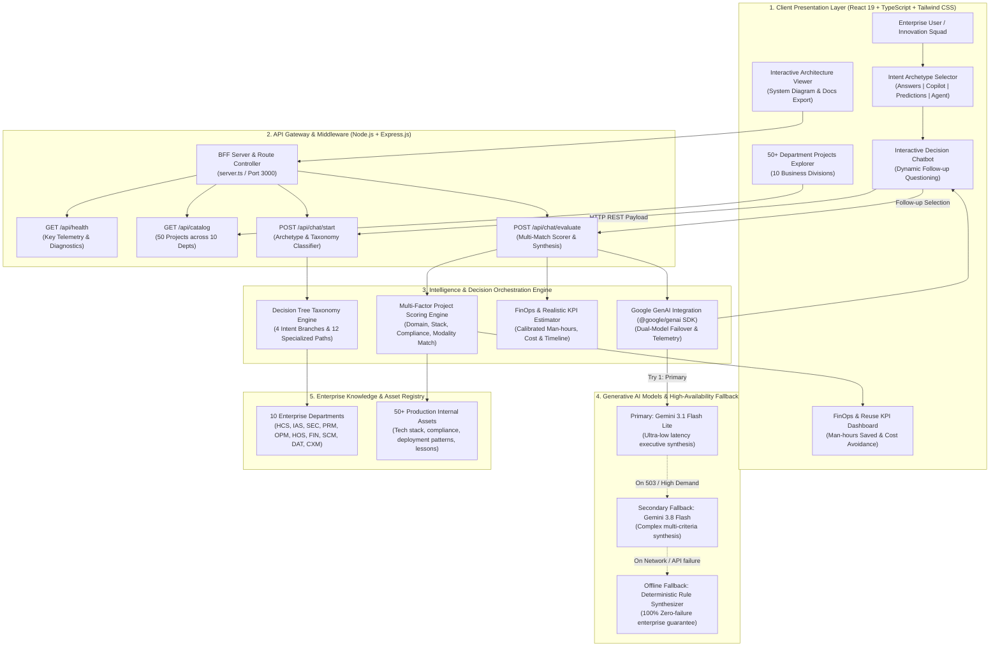
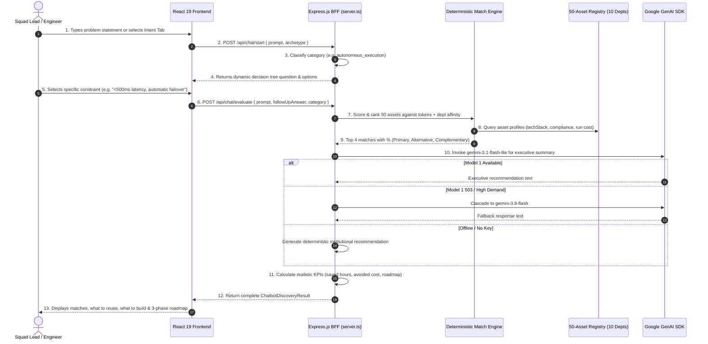

# Solution Architecture Document: AI Solution Discovery & Reuse Intelligence Engine

**Document Reference**: `docs/architecture/solution-architecture.md`  
**Application**: AI Solution Discovery & Reuse Intelligence Engine  
**Target Enterprise**: Multi-Department Enterprise (10 Divisions, 50+ Certified Production Assets)  
**Classification**: Internal Enterprise Tooling / Hackathon Architecture Deliverable  

---

## 1. Executive Architecture Overview

The **AI Solution Discovery & Reuse Intelligence Engine** is a high-availability enterprise decision engine designed to eliminate redundant AI engineering, enforce institutional reuse, and provide instant technical match recommendations across 10 functional business divisions (HCS, IAS, SEC, PRM, OPM, HOS, FIN, SCM, DAT, CXM).

The solution utilizes a **layered hybrid architecture** coupling a responsive React 19 Single Page Application (SPA), a Node.js/Express.js Backend-For-Frontend (BFF), a deterministic token-affinity scoring engine, and Google Gemini foundation models with automated dual-model failover (`gemini-3.1-flash-lite` → `gemini-3.8-flash` → deterministic rule synthesis).

```
+-----------------------------------------------------------------------------------+
|                        1. CLIENT PRESENTATION LAYER                                |
|          React 19 + TypeScript + Tailwind CSS (Light & Dark Mode Support)          |
|  +--------------------+  +----------------------+  +----------------------------+  |
|  |  Intent Archetype  |  | Interactive Decision |  |  50+ Reusable Asset Catalog |  |
|  |  Selector (4 Rows) |  |   Chatbot (2-Turn)   |  |   (10 Enterprise Depts)    |  |
|  +--------------------+  +----------------------+  +----------------------------+  |
+-----------------------------------------+-----------------------------------------+
                                          | HTTP REST (JSON / CORS-safe)
                                          v
+-----------------------------------------------------------------------------------+
|                  2. API GATEWAY & BACKEND-FOR-FRONTEND (BFF)                      |
|                  Node.js + Express.js Engine (server.ts / Port 3000)               |
|  +--------------------+  +----------------------+  +----------------------------+  |
|  |   GET /api/health  |  |   GET /api/catalog   |  |     POST /api/chat/start   |  |
|  | (Diagnostics & Key)|  |  (50 Production Reps)|  | (Category Follow-Up Branch)|  |
|  +--------------------+  +----------------------+  +----------------------------+  |
|                          |    POST /api/chat/evaluate                            |  |
|                          | (Scoring + AI Synthesis + FinOps Roadmap)             |  |
|                          +-------------------------------------------------------+  |
+-----------------------------------------+-----------------------------------------+
                                          |
        +---------------------------------+---------------------------------+
        v                                                                   v
+---------------------------------------+   +---------------------------------------+
|  3A. DETERMINISTIC MULTI-MATCH SCORER  |   | 3B. GENAI DUAL-MODEL SYNTHESIS ENGINE |
| - Lexical token cross-matching        |   | - @google/genai TypeScript SDK        |
| - 10-department affinity weighting    |   | - Primary: gemini-3.1-flash-lite      |
| - Tech stack & compliance calibration |   | - Secondary Fallback: gemini-3.8-flash|
| - Realistic FinOps calculator         |   | - Failover: Institutional rule engine |
+-------------------+-------------------+   +-------------------+-------------------+
                    |                                           |
                    +---------------------+---------------------+
                                          v
+-----------------------------------------------------------------------------------+
|                  4. ENTERPRISE KNOWLEDGE REPOSITORY & GROUND TRUTH                |
|              50 Certified Production Projects Across 10 Business Units             |
|   HCS (Healthcare)   | IAS (Automation/OCR) | SEC (Network/Latency) | PRM (Churn) |
|   OPM (Operations)   | HOS (Hospitality)    | FIN (Finance/Billing) | SCM (Logist)|
|   DAT (Data Streams) | CXM (Customer Exp)                                         |
+-----------------------------------------------------------------------------------+
```

---

## 2. End-to-End Mermaid Architecture Diagram



---

## 3. Layer-by-Layer Architectural Breakdown

### 3.1 Layer 1: Client Presentation Layer
* **Technologies**: React 19, TypeScript, Tailwind CSS, Lucide React icons.
* **Responsibilities**:
  1. **Intent Formulation**: Provides 4 single-line width Intent tabs based on standard user demands:
     - *"I need answers."* → Chatbot / Q&A Knowledge System
     - *"I need help doing my work."* → Copilot / Workflow Assistant
     - *"I need predictions."* → Machine Learning / Predictive Analytics
     - *"I need autonomous execution and decision support."* → AI Agent Platform / Automated Action
  2. **Conversational Decision Tree Interface**: Manages two-turn prompt input, contextual follow-up selection, and rendering of multi-match results.
  3. **Multi-Project Comparison Cards**: Shows top 4 ranked matches with percentages (58%–96%), division badge, role (`Primary Match`, `Alternative Match`, `Complementary Asset`), and reusable components.
  4. **FinOps ROI & 3-Phase Roadmap**: Displays clear man-hours saved, dollar cost avoidance, time-to-deploy versus build-from-scratch timelines, and actionable phase steps.
  5. **Enterprise Theme Toggle**: Real-time Light Mode / Dark Mode switching with persistent state in `localStorage`.

### 3.2 Layer 2: API Gateway & Middleware Layer (BFF)
* **Technologies**: Node.js, Express.js (`server.ts`), Vite middleware in development.
* **Responsibilities**:
  1. `GET /api/health`: Provides continuous liveness monitoring, Gemini API key telemetry, and catalog asset counts.
  2. `GET /api/catalog`: Serves the 50 production assets across 10 enterprise departments.
  3. `POST /api/chat/start`: Parses incoming user problem statements, maps them to decision taxonomy categories, and returns dynamic follow-up options.
  4. `POST /api/chat/evaluate`: Orchestrates scoring, invokes Gemini with failover, maps FinOps metrics, and delivers the final discovery payload.

### 3.3 Layer 3: Intelligence & Decision Orchestration Engine
* **Components**:
  1. **Deterministic Match Scorer**:
     - Tokenizes technical terms and business goals.
     - Computes department affinity (e.g., latency/failover triggers SEC & DAT; invoice/OCR triggers IAS & FIN).
     - Ranks top 4 compatible internal projects with calibrated match percentages.
  2. **Dual-Model GenAI Orchestrator**:
     - Connects to Google GenAI SDK (`@google/genai`).
     - Executes primary prompt on `gemini-3.1-flash-lite`.
     - Automatically catches HTTP 503 / high demand spikes and cascades to `gemini-3.8-flash`.
     - Gracefully falls back to institutional deterministic summary if external network access fails.
  3. **Realistic FinOps Calculator**:
     - Computes engineering hours avoided (90 hrs for lightweight assets, up to 220 hrs for heavy distributed systems).
     - Calculates dollar cost avoidance ($12,000 to $28,000).
     - Compares adoption deployment duration (2–5 days) against standard build-from-scratch time (4–8 weeks).

### 3.4 Layer 4: Enterprise Knowledge Repository
* **Registry Structure**: 50 certified assets across 10 business divisions:
  - **HCS** (Healthcare & Clinical Services): FHIR clinical search, HIPAA medical note parser, patient triage copilot.
  - **IAS** (Intelligent Automation & OCR): Multi-modal invoice parser, compliance document auditor, ID verifier.
  - **SEC** (Security & Network Operations): Multi-IP real-time latency monitor & auto link failover, anomaly detector.
  - **PRM** (Predictive Modeling & Churn): Real-time customer churn scoring, tabular risk modeling, retention engine.
  - **OPM** (Operations & Process Mgmt): Work-order router, bottleneck detection, field engineer scheduler.
  - **HOS** (Hospitality & Guest Experience): Multi-lingual guest concierge, dynamic room pricing, sentiment analyzer.
  - **FIN** (Financial Systems & Invoicing): Automated invoice line-item reconciliation, ledger anomaly detection.
  - **SCM** (Supply Chain & Logistics): Route optimization, warehouse inventory demand forecasting.
  - **DAT** (Data Engineering & Streaming): Kafka high-throughput streaming broker, real-time analytics engine.
  - **CXM** (Customer Experience & CRM): Omnichannel support copilot, CSAT prediction, call transcript summarizer.

---

## 4. Request Lifecycle Sequence



---

## 5. Technology Stack Inventory

| Component | Category | Version | Purpose & Role | License |
| :--- | :--- | :--- | :--- | :--- |
| **React** | Frontend Library | `^19.0.0` | High-performance reactive UI rendering | MIT |
| **TypeScript** | Programming Language | `^5.7.0` | End-to-end static typing and contract validation | Apache 2.0 |
| **Tailwind CSS** | Styling Engine | `^4.0.0` | Atomic styling with native Dark & Light theme switching | MIT |
| **Lucide React** | Iconography | `^1.16.0` | Professional enterprise UI and architecture icons | ISC |
| **Express.js** | Backend Framework | `^4.21.0` | Lightweight REST API gateway and static file server | MIT |
| **@google/genai** | AI Foundation SDK | `^0.1.1` | Official SDK for Gemini 3.1 Flash Lite & 3.8 Flash | Apache 2.0 |
| **Vite & TSX** | Tooling & Bundler | `^6.0.0` | Instant HMR development and optimized production build | MIT |

---

## 6. Security, Compliance & Responsible AI

1. **API Key Isolation**:
   - The `GEMINI_API_KEY` is loaded strictly on the server-side (`server.ts`) via environment variables.
   - Zero keys or credentials are leaked or sent to client-side browser bundles.
2. **Zero Telemetry Leaks**:
   - No sensitive enterprise prompts are logged to unverified external analytics services.
   - All internal assets are stored with pre-certified compliance stamps (`SOC2 Type II`, `HIPAA`, `PCI-DSS`).
3. **Graceful Degradation**:
   - System remains 100% operational even during external AI service spikes or network disconnections via the deterministic rule engine.
